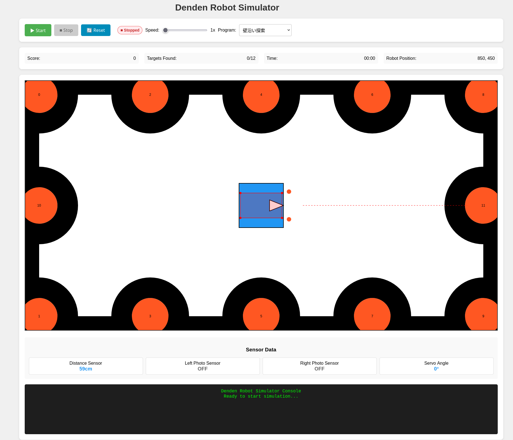

# Denden Robot Simulator

2D差動駆動ロボットシミュレーター - ターゲット探索・回避アルゴリズムの研究開発プラットフォーム

## 概要

本プロジェクトは、車輪付きロボットの2Dシミュレーション環境です。差動駆動ロボットがフィールド内のターゲットを自律探索し、障害物回避を行うシステムを提供します。ブラウザベースのリアルタイム描画により、アルゴリズムの動作を可視化できます。

## スクリーンショット


## 主な機能

### ロボットシミュレーション
- **差動駆動制御**: 左右独立2輪による精密な移動制御
- **リアルタイム物理演算**: 位置・角度・速度の正確なシミュレーション
- **センサーシミュレーション**: 距離センサー・フォトセンサーの実装

### フィールド環境
- **固定フィールド**: 80cm × 160cm、外周黒ライン付き
- **ターゲット配置**: 12個のターゲット（半径3cm）、40cm間隔で境界線上に配置
- **安全システム**: 衝突・落下検出、緊急停止機能

### 探索アルゴリズム
- **壁沿い探索**: 基本的な境界追従アルゴリズム
- **スパイラル探索**: 渦巻き状の系統的探索
- **ランダム探索**: 確率的な探索手法
- **格子探索**: グリッドベースの網羅的探索
- **ターゲット追跡**: 距離センサーを活用した直接的な接近

## システム要件

- **ブラウザ**: Chrome 80+, Firefox 75+, Safari 13+, Edge 80+
- **JavaScript**: ES6対応必須
- **解像度**: 1024×768以上推奨

## セットアップ

### 1. ファイル構成
```
denden_robot_simulator/
├── index.html              # メインページ
├── robot.yaml             # ロボット設定ファイル
├── README.md              # このファイル
├── algorithm.md           # アルゴリズム仕様書
├── test.md               # テスト仕様書
├── js/
│   ├── simulator.js       # メインシミュレーター
│   ├── robot.js          # ロボット制御
│   ├── field.js          # フィールド管理
│   ├── sensors.js        # センサーシミュレーション
│   ├── exploration_programs.js  # 探索アルゴリズム
│   ├── config_loader.js  # 設定ファイル読み込み
│   ├── config_manager.js # 設定値管理
│   └── constants.js      # 定数定義
└── css/
    └── style.css         # スタイルシート
```

### 2. 起動方法
```bash
# ローカルサーバーを起動（Python 3の場合）
python -m http.server 8000

# ブラウザでアクセス
open http://localhost:8000
```

## 使用方法

### 基本操作
1. **シミュレーション開始**: 「Start」ボタンをクリック
2. **探索アルゴリズム選択**: ドロップダウンメニューから選択
3. **速度調整**: スライダーでシミュレーション速度を調整
4. **リセット**: 「Reset」ボタンで初期状態に戻る

### 設定カスタマイズ
`robot.yaml`ファイルを編集することで、以下の設定を変更できます：
- ロボットの物理パラメータ（サイズ・速度・加速度）
- センサーの性能（測定範囲・精度・応答時間）
- 探索アルゴリズムの調整パラメータ
- 表示設定（色・軌跡・デバッグ情報）

### 探索アルゴリズムの実装
新しい探索アルゴリズムを追加するには：

1. `js/exploration_programs.js`に新しいクラスを追加
2. `BaseExplorationProgram`を継承
3. `execute(robot)`メソッドを実装

```javascript
class MyExplorationProgram extends BaseExplorationProgram {
    execute(robot) {
        // あなたの探索ロジックをここに実装
        const leftPhoto = robot.getL_Photo();
        const rightPhoto = robot.getR_Photo();
        const distance = robot.getDistance();
        
        // モーター制御
        robot.setMotorSpeeds(leftSpeed, rightSpeed);
        
        // サーボ制御
        robot.setServo(angle);
    }
}
```

## API リファレンス

### ロボット制御関数
- `setMotorSpeeds(leftSpeed, rightSpeed)`: 左右モーター速度設定（mm/s）
- `setServo(angle)`: 距離センサーサーボ角度設定（-90°～90°）
- `delay(milliseconds)`: 指定時間待機
- `millis()`: 起動からの経過時間取得

### センサー読み取り関数
- `getDistance()`: 距離センサー値取得（mm）
- `getL_Photo()`: 左フォトセンサー値取得（boolean）
- `getR_Photo()`: 右フォトセンサー値取得（boolean）

## スコアリングシステム

- **新規ターゲット発見**: 10点
- **既発見ターゲット再訪**: 2点
- **連続同一ターゲット**: 0点（加算なし）

## 安全システム

### 衝突検出
- ロボットの衝突判定ボックス（設定可能）が黒ライン上に侵入した場合
- デフォルト衝突判定サイズ: 20cm × 15cm

### 落下検出
- ロボットの衝突判定ボックスがフィールド外に出た場合
- 検出時は即座にシミュレーション停止

## 開発・デバッグ

### デバッグモード
`robot.yaml`の`debug`セクションで以下の設定が可能：
- `log_sensors`: センサー値のログ出力
- `log_movement`: 移動コマンドのログ出力
- `log_collisions`: 衝突イベントのログ出力
- `show_debug_info`: 画面上のデバッグ情報表示

### テスト
テスト仕様書は`test.md`を参照してください。

## パフォーマンス最適化

### 固定環境最適化
フィールド環境が完全に固定されていることを活用した最適化アルゴリズムを実装可能：
- 事前計算されたターゲット座標の活用
- 最短巡回路問題（TSP）の簡易解法
- セクション分割による効率的探索

詳細は`algorithm.md`の「最適化探索戦略」を参照してください。

## 貢献・開発

### 開発ワークフロー
1. センサー関数の実装・テスト
2. フィールド機能の実装・テスト
3. UI開発
4. 統合テスト

### プルリクエスト
- 新機能追加時は`algorithm.md`と`test.md`の更新も含める
- 設定変更時は`robot.yaml`のコメントも更新する

## ライセンス

本プロジェクトはMITライセンスの下で公開されています。

## 更新履歴

- **v1.0.0**: 基本機能実装（ロボット制御・センサー・探索アルゴリズム）
- **v1.1.0**: YAML設定ファイル対応、衝突検出最適化
- **v1.2.0**: 最適化探索戦略の追加

## 参考資料

- [アルゴリズム仕様書](algorithm.md)
- [テスト仕様書](test.md)
- [設定ファイル例](robot.yaml)