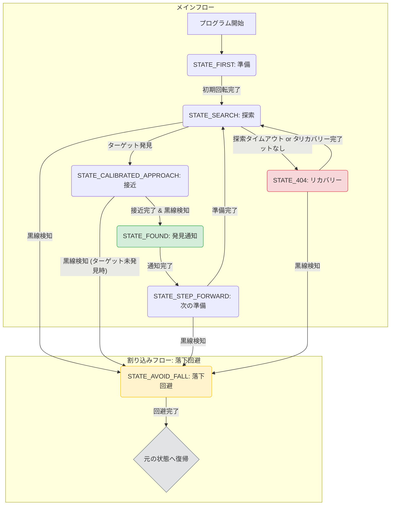

```mermaid
graph TD
    subgraph "メインフロー"
        Start[プログラム開始] --> S_FIRST(STATE_FIRST: 準備);
        S_FIRST -- "初期回転完了" --> S_SEARCH(STATE_SEARCH: 探索);
        
        S_SEARCH -- "ターゲット発見" --> S_APPROACH(STATE_CALIBRATED_APPROACH: 接近);
        S_SEARCH -- "探索タイムアウト or ターゲットなし" --> S_404(STATE_404: リカバリー);
        
        S_APPROACH -- "接近完了 & 黒線検知" --> S_FOUND(STATE_FOUND: 発見通知);
        
        S_FOUND -- "通知完了" --> S_STEP_FORWARD(STATE_STEP_FORWARD: 次の準備);
        
        S_STEP_FORWARD -- "準備完了" --> S_SEARCH;
        S_404 -- "リカバリー完了" --> S_SEARCH;
    end

    subgraph "割り込みフロー: 落下回避"
        %% 走行状態からAVOID_FALLへの遷移
        S_SEARCH -- "黒線検知" --> S_AVOID_FALL(STATE_AVOID_FALL: 落下回避);
        S_APPROACH -- "黒線検知 (ターゲット未発見時)" --> S_AVOID_FALL;
        S_STEP_FORWARD -- "黒線検知" --> S_AVOID_FALL;
        S_404 -- "黒線検知" --> S_AVOID_FALL;
        
        %% AVOID_FALLからの復帰
        S_AVOID_FALL -- "回避完了" --> S_PREVIOUS{元の状態へ復帰};
    end

    %% スタイル定義
    style S_FOUND fill:#d4edda,stroke:#28a745
    style S_404 fill:#f8d7da,stroke:#dc3545
    style S_AVOID_FALL fill:#fff3cd,stroke:#ffc107
    style S_PREVIOUS fill:#e2e3e5,stroke:#6c757d
```
